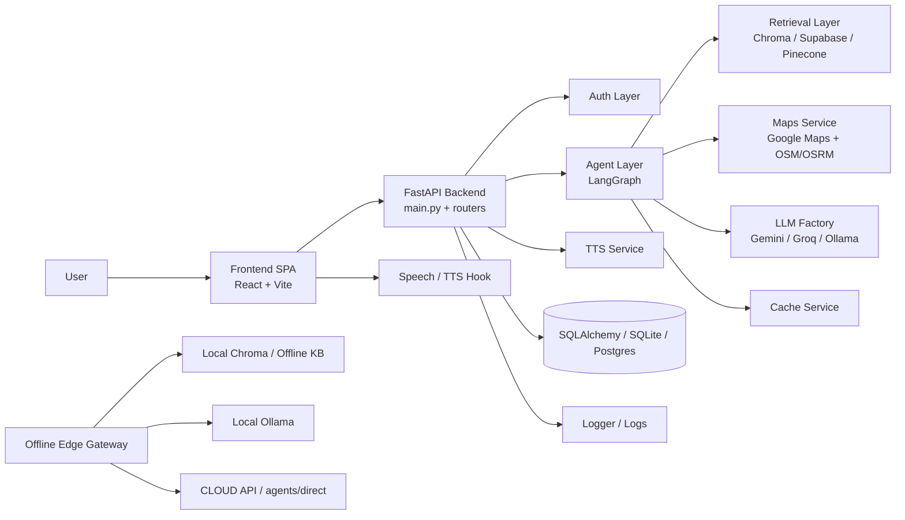

# COMPLETE AI Architecture Review & Refactoring Blueprint

## 1. Executive Summary

Repo hiện tại cho thấy một hệ thống AI Transportation Assistant có mức độ hoàn thiện cao về “proof of concept / MVP maturity”, nhưng chưa đạt chuẩn “production-ready architecture” vì tồn tại nhiều lớp logic trùng lặp, nhiều fallback phương án, cấu hình phân tán, và thiếu một service contract thống nhất cho online/offline/hybrid pipeline.

Tóm tắt đánh giá nhanh:

- Điểm mạnh:
  - Kiến trúc monolith + modular router/service rõ ràng về ý tưởng.
  - Có pipeline AI/LLM/RAG rõ ràng.
  - Có offline edge gateway và browser speech/TTS tích hợp.
  - Có test suite thực thi thành công trên các tính năng cốt lõi.
  - Có nhiều fallback và anti-prompt-injection logic tích hợp sẵn.

- Điểm yếu nghiêm trọng:
  - Chưa có một pipeline canonical duy nhất; online/offline/hybrid được triển khai trên nhiều entrypoint khác nhau.
  - Prompt, routing logic, intent extraction, fallback và tool-calling phân tán giữa các module (`routers/agents.py`, `services/langgraph_agent.py`, `tools/gtcc_tools.py`, `offline_edge/edge_gateway.py`).
  - Không có re-ranking layer rõ ràng; workflow mô tả có re-ranking nhưng trong repo không thấy implementation.
  - Vector store strategy và embedding strategy đang phụ thuộc vào lựa chọn runtime, không có abstraction thống nhất.
  - Documentation và naming convention chưa nhất quán: README, SYSTEM_DOCUMENTATION, code comments, và tên repo / product name chưa được thống nhất dưới danh pháp chuẩn `COMPLETE AI`.
  - Có nhiều “mock tool” và “fallback hardcode” trong hoạt động sản xuất, đặc biệt ở `tools/gtcc_tools.py` và `routers/agents.py`.

- Kết luận:
  - Hệ thống đang ở trạng thái “well-structured demo / RC candidate”, chưa sẵn sàng của một product AI transportation assistant chạy production ở quy mô doanh nghiệp.
  - Nên chuyển từ “feature-first monolith” sang “domain-driven service abstraction” với một orchestration layer thống nhất, và chia thành online pipeline, offline adapter, shared policy layer, observability layer.

---

## 2. Tổng quan hệ thống

Tên repo: `complete-ai-local`

Nhóm chức năng chính:

1. Backend API host
   - `main.py`
   - `routers/`
   - `services/`
   - `database.py`, `models.py`

2. Frontend SPA
   - `frontend/src/`
   - React + Vite + Tailwind + Zustand + React Query + Leaflet + Recharts

3. AI/LLM Layer
   - `llm_factory.py`
   - `services/langgraph_agent.py`
   - `services/ai_rag.py`
   - `tools/gtcc_tools.py`

4. Offline / Hybrid Layer
   - `offline_edge/edge_gateway.py`
   - `offline_edge/edge_rag.py`
   - local ChromaDB and on-device knowledge base

5. Data / Knowledge / Ingestion
   - `data/`
   - `ingest.py`, `ingest_local.py`, `ingest_all.py`
   - `scripts/prepare_finetune_data.py`

6. Deployment / Containerization
   - `Dockerfile`, `Dockerfile.frontend`, `docker-compose.yml`, `railway.toml`, `render.yaml`, `vercel.json`

---

## 3. Phân tích cấu trúc thư mục

### 3.1 Root backend

- `main.py`
  - Vai trò: entrypoint FastAPI host.
  - Thành phần chính: lifespan, middleware, router registration, health endpoints, static frontend file serving, TTS endpoint.
  - Đánh giá: có tính monolith host rõ ràng; tuy nhiên đang “gộp quá nhiều trách nhiệm” vào handler gốc.

- `config.py`
  - Vai trò: central config.
  - Thành phần chính: BaseSettings với LLM, embeddings, DB, vector store, RAG tuning, upload, auth settings.
  - Đánh giá: tốt về tập trung config nhưng thiếu nhiều field còn được đọc trực tiếp từ env hoặc trong service layer.

- `database.py`
  - Vai trò: async SQLAlchemy engine và session factory.
  - Thành phần chính: DB engine, shared `get_db`, create tables, seed admin.
  - Đánh giá: hợp lý cho monolith, nhưng thiếu repository pattern rõ ràng.

- `models.py`
  - Vai trò: ORM domain model.
  - Thành phần chính: `User`, `Document`, `Chat`, `RefreshToken`, `RouteQuery`, `LearningEvent`, `TopicMastery`.
  - Đánh giá: cấu trúc đủ cho MVP nhưng chưa có domain isolation theo business boundary.

### 3.2 `routers/`

- `auth.py`: authentication, Google OAuth, JWT.
- `rag.py`: document ingestion + RAG chat endpoint.
- `agents.py`: direct chat, stream chat, research-like chat.
- `maps.py`: geocoding + route API proxy.
- `learning.py`: feedback and learning analytics.
- `sync.py`: route telemetry / sync API.

Đánh giá:

- Tách endpoint theo chức năng tương đối tốt.
- Nhưng có sự chồng lấn trách nhiệm: `agents.py` vừa chat, vừa RAG, vừa fallback, vừa lưu event learning. Đây là một dạng “god router”.
- Một API layer mạnh nhưng chưa được chia theo use case domain riêng biệt như `conversation`, `routing`, `knowledge`, `identity`, `telemetry`.

### 3.3 `services/`

- `ai_rag.py`: vector store abstraction với Supabase / Pinecone / Chroma / InMemory fallback.
- `langgraph_agent.py`: agent workflow (analyze → tools → generate).
- `google_maps.py`: Maps integration + OSM fallback.
- `smart_route.py`, `route_planner.py`: routing logic.
- `cache_service.py`: LRU cache + Redis optional.
- `tts_service.py`: TTS implementation.
- `sanitizer.py`: prompt injection filter.
- `lang_detect.py`, `ai_topic.py`, `bike_service.py`.

Đánh giá:

- Đây là “core business logic” trong repo, cấu trúc tốt về mặt chức năng nhưng chưa có một domain boundary rõ ràng giữa “orchestration”, “policy”, “external integration”, “retrieval” và “analytics”.
- Một lượng logic vượt quá `services` và lẫn với router / prompt / workflow tạo nên tight coupling.

### 3.4 `offline_edge/`

- `edge_gateway.py`: online/offline router; checks network and forwards to cloud or local.
- `edge_rag.py`: local knowledge retrieval using local vector collection.

Đánh giá:

- Có giá trị tốt cho hybrid mode.
- Tuy nhiên đang là một “secondary FastAPI app” bên ngoài monolith, không được hợp nhất với backend chính. Điều này làm tăng số entrypoint và khó kiểm soát production consistency.

### 3.5 `frontend/`

- `src/pages/`, `src/features`, `src/hooks`, `src/store`, `src/services`.
- SPA uses `useNetworkStatus`, `useSpeech`, `react-leaflet`, `recharts`.

Đánh giá:

- UI structure hiện đại và hợp lý theo chuẩn Vite + React.
- Tuy nhiên app `App.tsx` vẫn giữ “dashboard + chat + map” trên một SPA; nếu mở rộng quy mô, cần tách thành domain-specific routes và feature modules with shared API-client layer.

### 3.6 `data/`

- Thư mục chứa dữ liệu GTCC, bus / metro knowledge, raw data, training data.
- Vai trò: nguồn tri thức cho RAG, finetune, và ingestion.

Đánh giá:

- Tốt về nguồn dữ liệu thực tế.
- Nhưng thiếu một data contract và versioning strategy rõ ràng. Số lượng dataset và ingestion scripts cho thấy project vẫn còn thử nghiệm nhiều.

### 3.7 `alerts/`

- Chứa script camera / DETR / accident monitor prototype, không được tích hợp chung vào hệ thống.

Đánh giá:

- Đây là “exploration / side project artifact”, không nên để trong production root mà nên tách vào `experiments/` hoặc `prototype/`.

---

## 4. Phân tích kiến trúc

### 4.1 Top-level Architecture

Hệ thống đang có cấu hình kiểu:

- Frontend SPA
- Backend FastAPI monolith
- AI orchestration by LangGraph
- RAG via vector store abstraction
- External dependencies: Gemini, Groq, OSM/OSRM, Google Maps, Supabase / Pinecone / Chroma
- Edge hybrid gateway for local fallback

### 4.2 Mermaid Diagram

### 4.3 Architectural Strengths

- FastAPI monolith gives quick shipping and simpler deployment.
- LangGraph orchestration makes intent → tool → generation pathway explicit.
- Hybrid fallback exists and is not only a documentation idea.
- Frontend has progressive web app and offline awareness integration.

### 4.4 Architectural Weaknesses

- No canonical “AI Request Contract” shared across routers and services.
- AI orchestration exists in two places: `routers/agents.py` and `services/langgraph_agent.py`.
- RAG retrieval is used directly in multiple endpoints with inconsistent search parameters and no unified retrieval policy.
- Hybrid mode exists but is not unified into a single mode selector / policy engine.
- No service mesh or queueing layer for asynchronous inference or protection against burst load.
- No explicit “observability contract” beyond logging.

---

## 5. Phân tích luồng Online

### 5.1 Online flow

User → Speech/Text → Intent Detection → Query Rewrite → Conversation Memory → RAG Retrieval → Tool Calling → Google Maps / Route Planner → LLM → Response Validation → Formatting → TTS

### 5.2 Đánh giá Online

Ưu điểm:

- Dễ triển khai và dễ debug vì các endpoint rõ ràng.
- `langgraph_agent.py` đóng vai trò orchestrator tốt cho một cấu trúc RAG + tool-calling.
- Cache và sanitizer giúp cải thiện response time và bảo mật.

Điểm nghẽn:

- LLM đã có `with_fallbacks` nhưng không có explicit circuit breaker / timeout policy separate from request-level call.
- Retrieval và LLM are both invoked synchronously in one request path; no async queue and no snapshot/retry strategy around provider spikes.
- `routers/agents.py` and `services/langgraph_agent.py` both have “intent / context / reply” logic; this doubles inference cost and maintenance burden.
- Không có re-ranker implementation thực tế trong repo dù hệ thống mô tả có re-ranking.

Rủi ro:

- Tăng latency khi provider rate limit / quota error.
- Fallback logic dùng static text / mock data; độ tin cậy không cao nếu thiếu dữ liệu hoặc LLM outage.
- Multi-source retrieval can output noisy context if `k` not controlled and `format_docs` lacks ranking quality metrics.

Khả năng tối ưu:

- Chuyển thành `Request Context Builder` + `Policy Router` + `Canonical Retrieval Service`.
- Đặt `ranker` và `citation` handler trong một service riêng, không để lẫn trong `langgraph_agent.py`.

---

## 6. Phân tích luồng Offline

### 6.1 Offline flow

User → Local STT → Local Retrieval → Local Vector DB → Local LLM → Local Knowledge Base → Response Validation → TTS

### 6.2 Đánh giá Offline

Tốc độ:

- Tốt nếu chạy trên máy local có Ollama và Chroma được preloaded.
- Tuy nhiên tốc độ phụ thuộc vào model size và local hardware.

Độ chính xác:

- Khả năng tốt hơn khi dùng local knowledge base và vector search, nhưng không đồng đều vì chưa có retrieval policy rõ ràng và không có benchmark benchmark chính thức.

Khả năng mở rộng:

- Hạn chế vì không có unified offline service contract + local model lifecycle management.

Khả năng chạy trên máy cá nhân:

- Có khả năng, nhưng cần kiểm soát package size, model download size, GPU/CPU capability, and memory footprint.

---

## 7. Phân tích luồng Hybrid

### 7.1 Hybrid flow

- Edge gateway checks network via HEAD request to public URL.
- If online: forward to cloud API path.
- If offline: use local Chroma / knowledge and local Ollama; if local model not available, use static fallback.

### 7.2 Đánh giá

- Chuyển đổi Online ↔ Offline: có cơ chế, nhưng chỉ là “simple ping + fallback” và chưa có deterministic context sync policy.
- Đồng bộ hội thoại: chưa có shared session state giữa cloud and edge. Cần có canonical conversation state, not separate implementations.
- Đồng bộ dữ liệu: chỉ có local cache / in-memory cache, không có durable sync contract.
- Cơ chế fallback: có nhưng hard-coded trong nhiều nơi; cần standardize thành “policy-driven fallback ontology”.
- Khả năng phục hồi khi mất mạng: có, nhưng ở mức “soft fail” hơn là “graceful degraded service continuity”.

---

## 8. Đánh giá Backend

### 8.1 Backend strengths

- FastAPI and async SQLAlchemy are modern and tool-friendly.
- Route structure is reasonably clean.
- Health endpoint and logs provide basic observability.
- Redis / TTL cache provides quick response optimization.

### 8.2 Backend risks

- Multiple code paths for same user intent: `agents.py`, `langgraph_agent.py`, `rag.py`, `edge_gateway.py`.
- `get_db` yields commit in dependency; good but too generic for multiple data domains.
- `seed_superuser` and admin seeding via environment variable is not robust for production onboarding.
- No durable background jobs or orchestration queue.

### 8.3 Backend recommendations

- Introduce `ApplicationServices` layer to own orchestration and external integrations.
- Move prompt-building into a `PromptPolicy` module.
- Move retrieval and reranking into a dedicated service (e.g., `services/retrieval_service.py`).
- Introduce one request DTO for `ChatCommand`, `RouteCommand`, `DocumentCommand`.

---

## 9. Đánh giá Frontend

### 9.1 Frontend strengths

- Good UI toolkit and modern React architecture.
- `useNetworkStatus` provides online/offline awareness.
- `useSpeech` shows browser speech support integration.
- Service worker and PWA manifest are enabled.

### 9.2 Frontend risks

- `useNetworkStatus` is a simple network check; it does not verify actual backend health or app-critical service dependency.
- Frontend uses a “single route app” with multiple functional domains merged in a single SPA; may become hard to scale.
- There is no visible dedicated plan for “hybrid conversation sync” on the client side.

### 9.3 Frontend recommendations

- Add one frontend domain or feature boundary layer: `chat`, `map`, `admin`, `offline`, `auth`.
- Add an application state machine for `online/offline/hybrid` state transitions.
- Introduce `syncQueue` as a first-class feature with consistent telemetry.

---

## 10. Đánh giá AI / LLM / RAG

### 10.1 LLM layer

- `llm_factory.py` supports the right direction: Gemini, Groq, Ollama.
- Fallback provider path exists.
- Health check is present.

Weakness:

- LLM selection is environment-driven, but fallbacks remain manual and dynamic; no unified provider policy or circuit breaker.
- System prompt is centralized but duplicated in `routers/agents.py`, `routers/rag.py`, and `offline_edge/edge_gateway.py` in different forms.

### 10.2 RAG layer

- `ai_rag.py` supports vector store fallback chain: Supabase → Pinecone → Chroma → InMemory.
- Retrieval is reasonably structured.

Weakness:

- No explicit reranking layer exists in code. This is a major mismatch with the ideal workflow listed in the mission.
- Retrieval depends on top-k and similarity search without slotting in evaluation metrics.
- `embedding_engine` and `llm_engine` are independent but not managed under the same policy.

### 10.3 Prompt Engineering status

- Prompt policy is present in `llm_factory.py` and some router templates.
- However, there are multiple prompt sources and inconsistent prompt naming.
- This is a known risk for production prompt governance.

---

## 11. Đánh giá Code Quality

### 11.1 Verified test evidence

I ran `pytest -q` in the workspace.

Evidence:

- `23 passed, 4 warnings in 22.16s`

This means the current test suite gives a “decent smoke signal” but not full production assurance.

### 11.2 Code quality findings

| Issue                        | Evidence                                                                                                                | Impact        | Root cause                                               | Proposed remediation                                                                     |
| ---------------------------- | ----------------------------------------------------------------------------------------------------------------------- | ------------- | -------------------------------------------------------- | ---------------------------------------------------------------------------------------- |
| Dead code / orphan structure | `alerts/` contains experimental scripts and a commented-out file name pattern; not integrated.                          | Low to Medium | Side experiments not removed from main repo.             | Move to `experiments/` or remove after audit.                                            |
| Duplicate code               | `routers/agents.py` and `services/langgraph_agent.py` each have intent-handling and answer-building logic.              | High          | Feature-first growth without central service.            | Consolidate into one orchestration service.                                              |
| Code smell                   | `main.py` mounts frontend and defines endpoints in same file; repository level mixing of web host + business API + TTS. | Medium        | Monolith entrypoint has too many responsibilities.       | Split bootstrapping, API, TTS, and static hosting into separate modules.                 |
| Technical debt               | `tools/gtcc_tools.py` still uses mock route/ticket data with `TODO`.                                                    | High          | The tool layer is not backed by real data source yet.    | Replace with controlled data adapter backed by real GTCC dataset.                        |
| Circular dependency risk     | `routers/__init__.py` states “do NOT import here, causes circular deps”.                                                | Medium        | Package init side effects / import order sensitivity.    | Make router imports explicit and avoid package-level imports.                            |
| Tight coupling               | `agents.py` depends on `graph_app`, `cache`, `sanitize`, `topic`, DB session, and fallback all in one endpoint.         | High          | Strong aggregator endpoint.                              | Boundary separation across `ApplicationService`, `QueryHandler`, `Repository`, `Policy`. |
| Missing abstraction          | Vector retrieval and LLM provider selection vary by branch and config path.                                             | High          | Runtime flexibility but no unified abstraction contract. | Introduce `ProviderPort`, `RetrievalPort`, `ModePolicy`.                                 |
| Hardcode                     | Some route fallback strings, location defaults, and route suggestions are static text.                                  | Medium        | Demo / fallback heuristics embedded directly.            | Replace with domain configuration and knowledge base.                                    |
| Missing logging              | Logging exists, but not unified across all external services and error telemetry.                                       | Medium        | ad hoc logger usage.                                     | Add structured logger and telemetry tracing.                                             |
| Missing exception handling   | Some service functions swallow errors with `pass` or fallback behavior with no traceable metrics.                       | Medium        | fast failure path tradeoff.                              | Standardize error envelopes and telemetry.                                               |
| Missing tests                | No end-to-end performance and load test for hybrid mode. No benchmark suite for retrieval quality or latency.           | High          | Test suite focuses on smoke coverage.                    | Add synthetic benchmark + load tests.                                                    |
| Missing docs                 | `frontend/README.md` is default Vite template, not project documentation.                                               | Medium        | Documentation drift.                                     | Replace with product-specific docs.                                                      |

---

## 12. Đánh giá Documentation

### 12.1 Current docs reviewed

- `README.md`
- `SYSTEM_DOCUMENTATION.md`
- `frontend/README.md`
- API docs exposed by FastAPI `/docs`
- Deployment manifests and env hints

### 12.2 Findings

- Tính nhất quán: thấp-medium. README and SYSTEM_DOCUMENTATION describe the same system but with name drift and different maturity claims.
- Thiếu nội dung: thiếu architecture decision record, ADR, data contract, service ownership, release criteria, benchmark plan, and production readiness checklist.
- Trùng lặp: multiple places describe the same structure and some claims conflict with code reality.
- Sai tên: repo and product branding are inconsistent (`COMPLETE AI`, `COMPLETE AI Local`, `HN Transit AI`, `GTCC Bot`).
- Sai phiên bản: `main.py` reports `5.1.0` health response while README and config say `5.10.0`. This is a clear version mismatch.

### 12.3 Recommendation

Chuẩn hóa toàn bộ tài liệu dưới tên thống nhất:

- `COMPLETE AI`

Và chuẩn hóa các nhánh tài liệu sau:

1. Product architecture
2. System integration architecture
3. API contract
4. Deployment runbook
5. Offline/hybrid runbook
6. Quality gates and test strategy
7. Release checklist

---

## 13. Điểm mạnh của hệ thống

1. Có roadmap chức năng rõ ràng và nhiều tính năng đã được triển khai.
2. Backend và frontend đều có cấu trúc khá tốt cho một MVP / RC.
3. AI orchestration via LangGraph is a solid architectural foundation.
4. Hybrid offline fallback is a pragmatic differentiator.
5. Test suite already covers auth, prompt injection, RAG, routing, and offline handling.
6. Logs, cache, and request IDs are already present in key paths.

---

## 14. Điểm yếu của hệ thống

1. Không có unified orchestration layer.
2. Không có canonical production mode selector (online/offline/hybrid).
3. Không có re-ranking implementation despite being described as part of the ideal flow.
4. Documentation drift and naming drift reduce maintainability.
5. Multiple fallback providers are scattered and hardcoded.
6. Tool-calling layer still references mock data.
7. Production readiness depends on too many environmental assumptions (API keys, local Ollama, etc.).
8. Data / vector store abstraction is present, but not yet robustly governed.

---

## 15. Danh sách Technical Debt

1. `tools/gtcc_tools.py` mock tool implementation.
2. Duplicate agent logic across `routers/agents.py` and `services/langgraph_agent.py`.
3. `alerts/` contains side-prototype scripts left in the root repository.
4. Version drift between `config.py`, `main.py`, and `README.md`.
5. Prompt policy duplicated across modules.
6. Hardcoded location defaults and route fallback text.
7. No explicit RAG evaluation / reranking / citation pipeline.
8. No formal telemetry schema for request tracing and business KPIs.

---

## 16. Danh sách rủi ro

1. LLM provider outage causes partial or inconsistent answer quality.
2. Local offline model not available or not performant on target hardware.
3. Incomplete data governance for knowledge ingestion and vector indexing.
4. Hardcoded route fallback can give wrong route suggestions if location not resolved correctly.
5. Hybrid mode sync is not guaranteed because state is not formally centralized.
6. Prompts and tool call logic remain unstable under future scaling.
7. Security and privacy posture improves, but not enough to be called enterprise-grade without a formal review and benchmark.

---

## 17. Kiến trúc đề xuất

### 17.1 Target architecture

Tối ưu hóa sang mô hình “bounded domain services + policy orchestration”, ví dụ:

- `api/` — HTTP contracts
- `application/` — use cases and orchestration
- `domain/` — models and core business policies
- `infrastructure/` — integrations: vector store, LLM provider, maps, cache, DB, telemetry
- `edge/` — offline gateway and device runtime

### 17.2 Proposed production direction

1. One canonical request pipeline
   - `ConversationRequest` → `ModeResolver` → `IntentClassifier` → `RetrievalPolicy` → `LLMOrchestrator` → `ResponseValidator` → `Renderer`

2. Separate provider interfaces
   - `LLMProviderPort`
   - `VectorStorePort`
   - `MapProviderPort`
   - `TtsProviderPort`

3. Add a retrieval pipeline with
   - query rewrite
   - retrieval
   - re-rank
   - dedupe
   - citation generation

4. Add a mode-detection and policy layer
   - `online` → cloud API selected
   - `offline` → local vector + local LLM
   - `hybrid` → edge decision engine with sync and fallback policy

5. Add observability and product telemetry
   - request trace ID
   - provider latency
   - retrieval hit rate
   - fallback rate
   - user satisfaction signal
   - error budget

---

## 18. Roadmap tối ưu theo từng giai đoạn

### Giai đoạn 1 — Critical Architecture Issues

- Mục tiêu: thống nhất service ownership và eliminate duplicate orchestration.
- Lợi ích: giảm maintenance cost và bug surface.
- Rủi ro: cần refactor lớn, có thể làm đứt flow trong ngắn hạn nếu chưa chuẩn hóa contract.
- Độ ưu tiên: P0
- Ước lượng công việc: 1–2 tuần kỹ sư backend leading + 1 tuần QA + 1 tuần docs

### Giai đoạn 2 — Online Pipeline

- Mục tiêu: chuyển online flow sang one canonical service path with unified provider abstraction.
- Lợi ích: tăng độ ổn định, giảm provider-specific branching.
- Rủi ro: provider changes may break tests.
- Độ ưu tiên: P0
- Ước lượng công việc: 1–2 tuần

### Giai đoạn 3 — Offline Pipeline

- Mục tiêu: đơn giản hóa local vector store and local model lifecycle.
- Lợi ích: cải thiện độ tin cậy khi mất mạng.
- Rủi ro: local hardware variance.
- Độ ưu tiên: P1
- Ước lượng công việc: 1 tuần

### Giai đoạn 4 — Hybrid Pipeline

- Mục tiêu: formalize online ↔ offline mode transitions and synchronization rule.
- Lợi ích: extreme resilience and better user trust.
- Rủi ro: state sync complexity.
- Độ ưu tiên: P1
- Ước lượng công việc: 1–2 tuần

### Giai đoạn 5 — API Stability

- Mục tiêu: stabilize endpoint contracts, response schema, and versioning.
- Lợi ích: giảm regression và easier frontend integration.
- Rủi ro: breaking changes must be carefully versioned.
- Độ ưu tiên: P1
- Ước lượng công việc: 3–5 ngày

### Giai đoạn 6 — Prompt Engineering

- Mục tiêu: centralize prompt maintainability, evaluate prompts and tasks.
- Lợi ích: stronger answer consistency.
- Rủi ro: over-optimizing prompt may reduce flexibility.
- Độ ưu tiên: P1
- Ước lượng công việc: 3–5 ngày

### Giai đoạn 7 — RAG Optimization

- Mục tiêu: add reranking, citation policy, chunk quality, evaluation benchmark.
- Lợi ích: nâng chất lượng answer và giảm hallucination.
- Rủi ro: benchmark complexity and insufficient data.
- Độ ưu tiên: P1
- Ước lượng công việc: 1–2 tuần

### Giai đoạn 8 — Performance

- Mục tiêu: latency and throughput tuning with caching, queueing, observability.
- Lợi ích: better production UX.
- Rủi ro: cost increase if not measured.
- Độ ưu tiên: P2
- Ước lượng công việc: 1 tuần

### Giai đoạn 9 — UX

- Mục tiêu: speech flow, response formatting, offline indicator logic, fallback UX.
- Lợi ích: higher trust and satisfaction.
- Rủi ro: UX improvement can be subjective.
- Độ ưu tiên: P2
- Ước lượng công việc: 3–5 ngày

### Giai đoạn 10 — Production Readiness

- Mục tiêu: security, reliability, benchmark, runbook, SLO/SLA, deployment hygiene.
- Lợi ích: readiness for go-live.
- Rủi ro: if skipped, all earlier improvements are still fragile.
- Độ ưu tiên: P0
- Ước lượng công việc: 1–2 tuần + blueprint for release gates

---

## 19. Kết luận cuối

Repo `COMPLETE AI Local` hiện đang là một nền tảng AI transportation assistant có tiềm năng tốt và giàu chức năng, nhưng nó vẫn đang ở trạng thái “mạnh về MVP / RC” và “chưa đủ mạnh về production architecture”. Điểm quan trọng nhất cần xử lý không phải là thêm tính năng mới, mà là:

1. thống nhất pipeline,
2. tách service ownership,
3. chuẩn hóa prompt và retrieval policy,
4. đời sống hybrid mode và observability,
5. dựng một production readiness checklist rõ ràng.

Nếu bước tiếp theo sẽ là refactor, nên bắt đầu từ:

- service contract governance,
- unified orchestration layer,
- retrieval + reranking policy,
- provider interface abstraction,
- observability and SLO-focused telemetry.

Bước này là nền tảng vững cho các giai đoạn tối ưu tiếp theo, không phải chỉ thêm tính năng.
