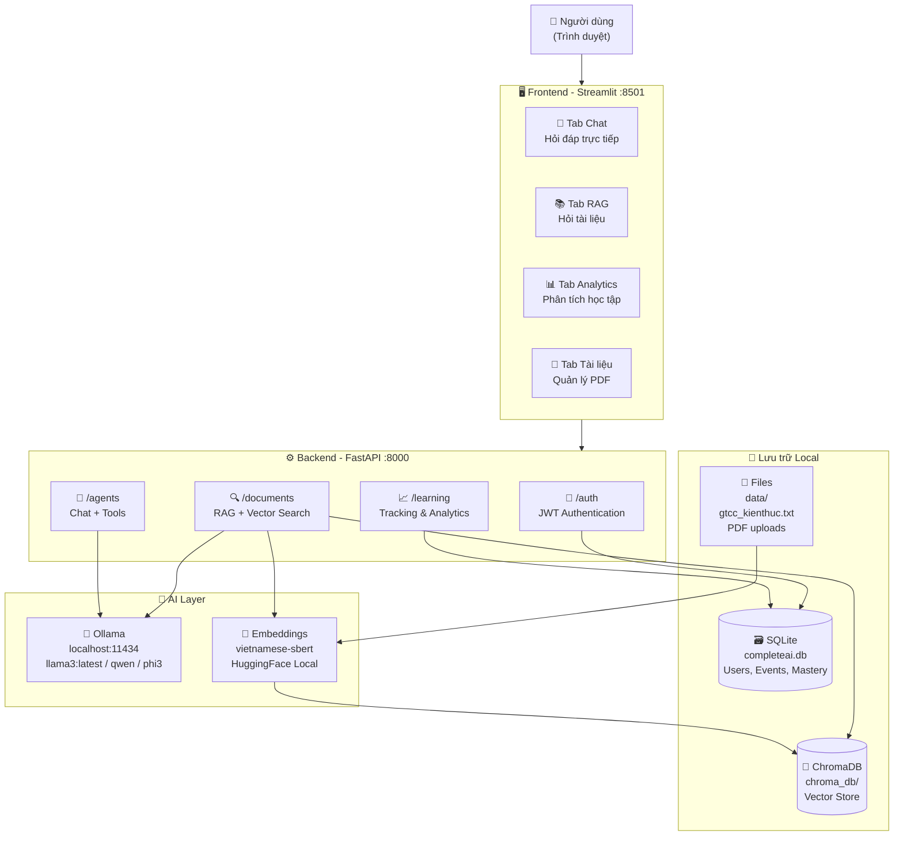
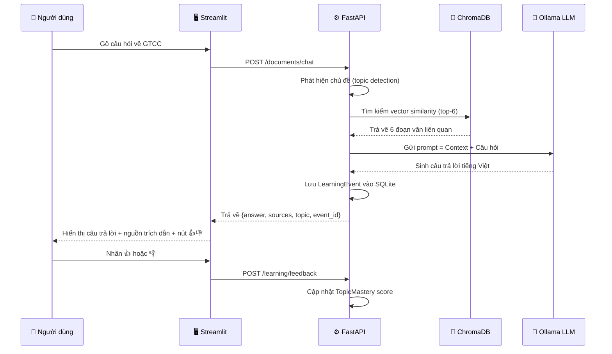
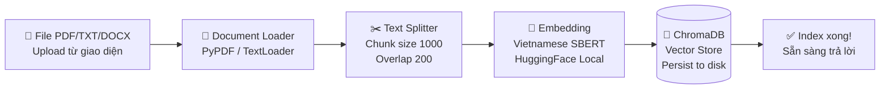
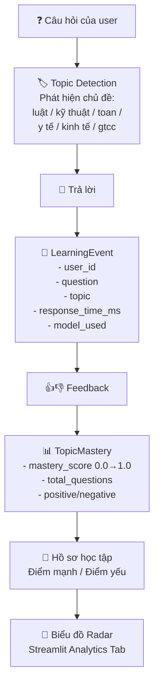
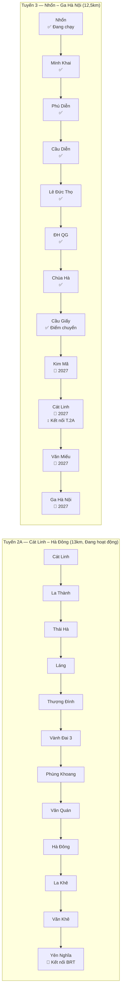
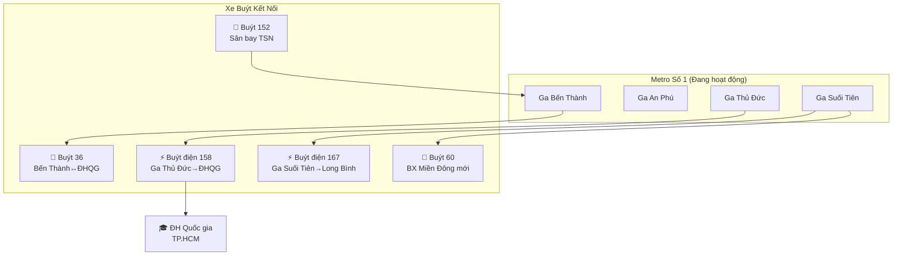
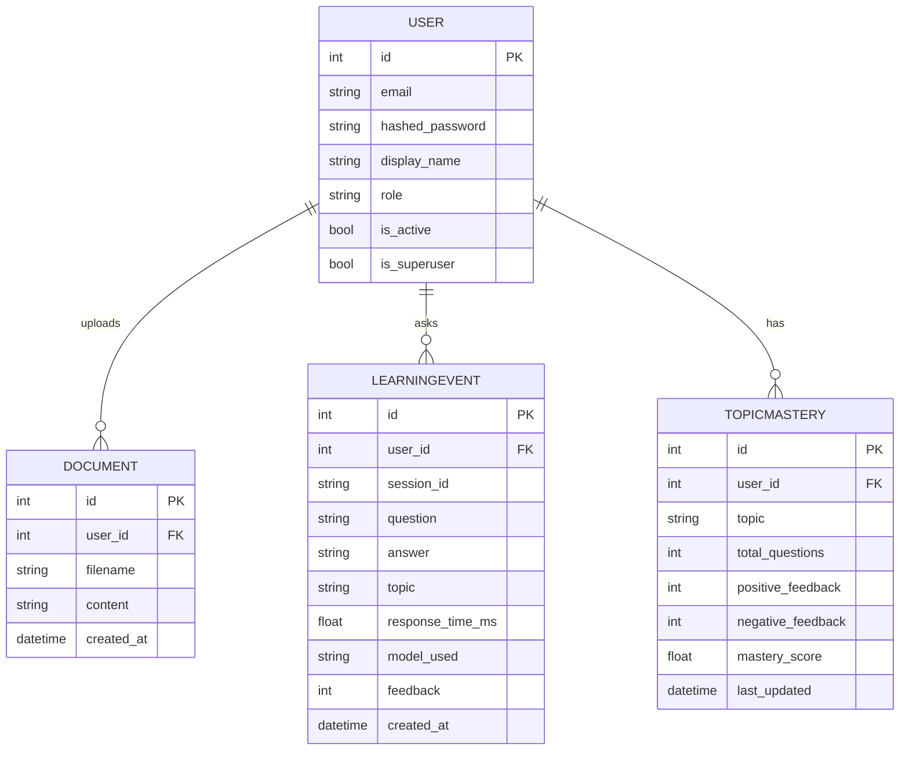
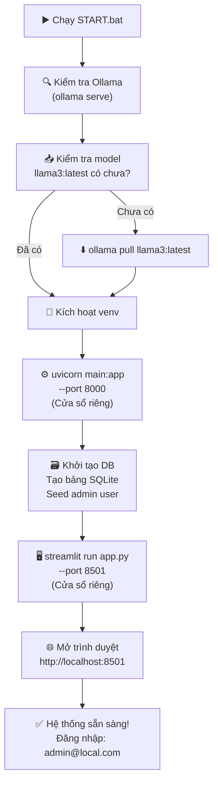

```mermaid
graph LR
    BT["🚇 Bến Thành\n[Ngầm B3]\n★ Hub chính"]
    BS["Ba Son\n[Ngầm]"]
    VT["Văn Thánh\n[Ngầm]"]
    TC["Tân Cảng\n▲ Trên cao"]
    TD["Thảo Điền\n▲"]
    AP["An Phú\n▲ AEON"]
    RC["Rạch Chiếc\n▲"]
    PL["Phước Long\n▲"]
    BT2["Bình Thái\n▲"]
    TDu["Thủ Đức\n▲ ĐH QG"]
    CNC["KHU CNC\n▲ SHTP"]
    TP["Tân Phú\n▲"]
    BD["Bình Dương\n▲"]
    ST["🏁 Suối Tiên\n▲ Hub cuối"]

    BT --> BS --> VT --> TC --> TD --> AP --> RC --> PL --> BT2 --> TDu --> CNC --> TP --> BD --> ST
```

# 🗺️ Sơ Đồ Hệ Thống GTCC Bot & Mạng Lưới Giao Thông Công Cộng VN

---

## 1. Kiến Trúc Hệ Thống GTCC Bot



---

## 2. Luồng Xử Lý Câu Hỏi RAG



---

## 3. Luồng Upload & Index Tài Liệu



---

## 4. Hệ Thống Cá Nhân Hóa Học Tập



---

## 5. Sơ Đồ Mạng Lưới Metro TP.HCM

```
BẾN THÀNH ●────────────────────────────────────────────● SUỐI TIÊN
(Metro 1)  │                                            │
  Q.1      Ba Son ─ Văn Thánh ─ Tân Cảng ─ Thảo Điền  Bình Dương ─ Tân Phú ─ CNC ─ Thủ Đức ─ Bình Thái ─ Phước Long ─ Rạch Chiếc ─ An Phú
           [Ngầm]   [Ngầm]     [Trên cao] ...........  ................................................. [Trên cao]

KÝ HIỆU:
  ● = Ga cuối tuyến
  ─ = Ga trên cao
  [Ngầm] = Ga dưới lòng đất
  * = Điểm kết nối metro tương lai

Khoảng cách tổng: 19,7 km | Thời gian: ~30 phút | 14 ga
```



---

## 6. Sơ Đồ Metro Hà Nội



---

## 7. Sơ Đồ Kết Nối Metro – Xe Buýt TP.HCM



---

## 8. Biểu Đồ So Sánh Giá Vé GTCC

```
GIÁ VÉ LƯỢT (đồng)

Metro TP.HCM (0–4km)  ████ 6,000
Metro TP.HCM (toàn)   ████████████████████ 20,000
Metro HN (Cát Linh)   ████████ 8,000 – 15,000
Metro HN (Tuyến 3)    ████████ 8,000 – 15,000
Buýt điện TSN (SV)    ███ 3,000
Buýt điện TSN         █████ 5,000 – 6,000
Buýt TP.HCM ngắn      █████ 5,000
Buýt TP.HCM dài       ████████ 7,000 – 8,000
Buýt Hà Nội (<15km)   ████████ 8,000
Buýt Hà Nội (>40km)   ████████████████████ 20,000
Buýt sông TP.HCM      ███████████████ 15,000
BRT Hà Nội            ████████ 9,000
```

---

## 9. Biểu Đồ Giờ Hoạt Động

```
Hệ thống         | 04 | 05 | 06 | 07 | 08 | ... | 21 | 22 | 23
─────────────────|────|────|────|────|────|─────|────|────|────
Metro 1 TP.HCM   |    | ██ | ██ | ██ | ██ | ██  | ██ | ██ |
Metro 2A HN      |    | ██ | ██ | ██ | ██ | ██  | ██ | ██ | ██
Metro 3 HN       |    | ██ | ██ | ██ | ██ | ██  | ██ | ██ |
Buýt HCM (nhiều) | ██ | ██ | ██ | ██ | ██ | ██  | ██ |    |
Buýt HN (nhiều)  |    | ██ | ██ | ██ | ██ | ██  | ██ |    |
BRT HN           | ██ | ██ | ██ | ██ | ██ | ██  | ██ | ██ |
Buýt sông HCM    |    | ██ | ██ | ██ | ██ | ██  | ██ |    |
```

---

## 10. Cấu Trúc Database



---

## 11. Luồng Khởi Động Hệ Thống



---

*Tài liệu: GTCC Bot System Diagrams v3.0 | Cập nhật: 2026-05*
